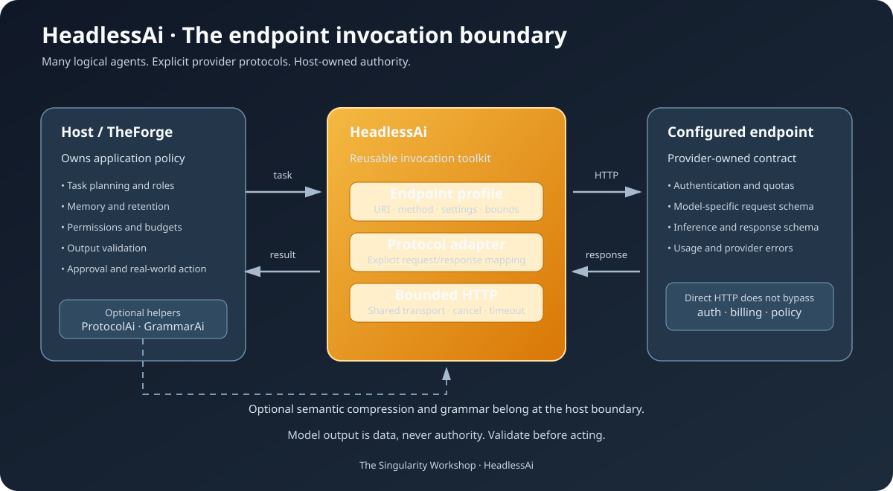

# HeadlessAi documentation

The canonical reader map is the repository-root [Documentation Index](../DOCUMENTATION_INDEX.md). The README follows the Workshop's shared front-door sequence; this folder holds focused guides that teach one topic at a time.

## Learn the domain

- [What is HeadlessAi?](WHAT_IS_HEADLESSAI.md) — accessible mental model.
- [Problem Domain](problem-domain.md) — vocabulary, lifecycle, scope, and non-goals.
- [Theory](THEORY.md) — rationale, assumptions, and invariants.
- [Architecture and Theory](architecture-and-theory.md) — the implementation model.
- [Architecture Boundaries](architecture-boundaries.md) — responsibility and dependency direction.

## Use and integrate

- [Usage](usage.md) — profiles, templates, agents, and custom adapters.
- [Provider Adapters](provider-adapters.md) — built-in endpoint schemas and limitations.
- [Use Cases](use-cases.md) — scenarios and fit boundaries.
- [Security](security.md) — credentials, trust, and bounded responses.

## Measure and develop

- [Performance](performance.md) — current performance posture.
- [Benchmark Methodology](benchmark-methodology.md) — local benchmark scope and reporting rules.
- [Measurement Plan](measurement-plan.md) — evaluate ProtocolAi + GrammarAi without assuming the outcome.
- [Roadmap](roadmap.md) — staged work.
- [Repository Map](repository-map.md) — where implementation and tests live.
- [Continuation Brief](CONTINUATION_BRIEF.md) — current status and next engineering tasks.

## Visual architecture

The host owns intent, permissions, memory, validation, and consequential actions. HeadlessAi owns endpoint invocation and protocol adapters. Provider endpoints retain their own schemas and access policies.

---

<em>The Singularity Workshop — Tools for the curious, the bold, and the systemically inclined.</em> <strong>Because state shouldn't be a mess.</strong>

